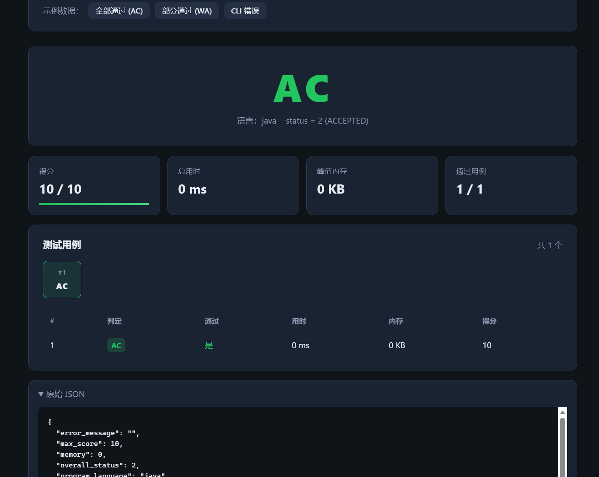

# 26 春季软件工程综合实验 尹智辉 个人报告

## 1. 个人任务

### 简述

本次OJ系统实验，我负责OJ系统的评测模块的开发，以及评测完成后的前端页面。

1. 评测模块的主要功能是接收用户提交的代码，调用评测环境进行评测，返回评测结果。
2. 评测完成后的前端页面的主要功能是展示评测结果，包括评测时间、评测内存、评测输出等。
3. 评测完成后的前端页面需要与评测模块进行交互，接收评测结果并展示在页面上。

最终实现的结果是：交付可运行的exe文件，通过
```
.\judge_engine.exe `
  --program_language=<language> `
  --src_file=<src_file> `
  --expect_result=<expect_result>
```
运行，同时自动跳转到评测完成后的前端页面。

### 功能展示

前端页面展示如下：


## 2. 项目开发过程中学习的技术和工具

## 3. 项目开发过程中使用的辅助工具

### 清单

代码管理工具：Git
IDE：Visual Studio Code, Cursor
LLM：DeepSeek-V4-Pro

### 视频展示

## 4. 个人相关工作量统计数据

