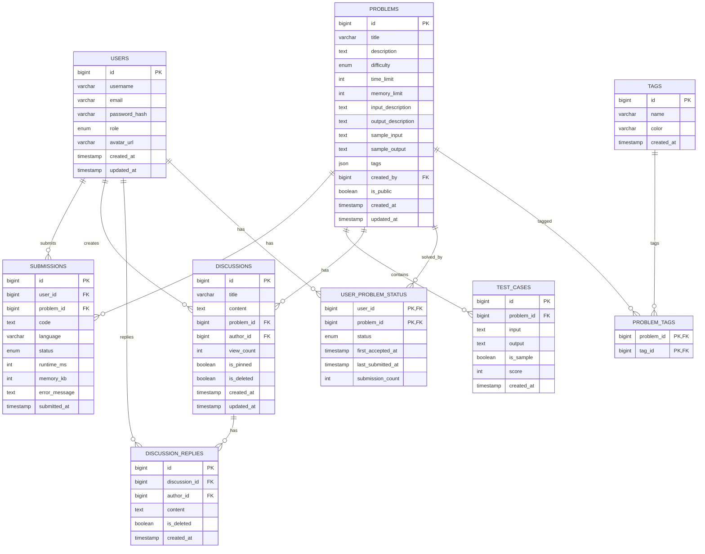

# 在线判题系统（OJ）- 数据模型设计

## 一、概述

### 1.1 设计目标
- 支持高并发访问
- 保证数据一致性
- 便于查询和统计
- 支持业务扩展

### 1.2 数据库选型
- **主数据库**: MySQL 8.0
- **缓存**: Redis 7.0+
- **消息队列**: RabbitMQ

## 二、实体关系图



## 三、数据表设计

### 3.1 用户表 (users)

存储用户基本信息

```sql
CREATE TABLE users (
    id BIGINT UNSIGNED PRIMARY KEY AUTO_INCREMENT COMMENT '用户ID',
    username VARCHAR(50) NOT NULL COMMENT '用户名',
    email VARCHAR(100) NOT NULL COMMENT '邮箱',
    password_hash VARCHAR(255) NOT NULL COMMENT '密码哈希',
    role ENUM('user', 'admin') DEFAULT 'user' COMMENT '角色',
    avatar_url VARCHAR(255) DEFAULT NULL COMMENT '头像URL',
    created_at TIMESTAMP DEFAULT CURRENT_TIMESTAMP COMMENT '创建时间',
    updated_at TIMESTAMP DEFAULT CURRENT_TIMESTAMP ON UPDATE CURRENT_TIMESTAMP COMMENT '更新时间',
    
    UNIQUE KEY uk_username (username),
    UNIQUE KEY uk_email (email),
    INDEX idx_created_at (created_at)
) ENGINE=InnoDB DEFAULT CHARSET=utf8mb4 COMMENT='用户表';
```

**字段说明**:
- `id`: 主键，自增
- `username`: 用户名，唯一，3-20字符，字母数字下划线
- `email`: 邮箱，唯一，用于登录和通知
- `password_hash`: 密码哈希，使用bcrypt加密
- `role`: 角色，user(普通用户)或admin(管理员)
- `avatar_url`: 头像URL，可选
- `created_at`: 创建时间
- `updated_at`: 更新时间

### 3.2 题目表 (problems)

存储题目信息

```sql
CREATE TABLE problems (
    id BIGINT UNSIGNED PRIMARY KEY AUTO_INCREMENT COMMENT '题目ID',
    title VARCHAR(255) NOT NULL COMMENT '题目标题',
    description TEXT NOT NULL COMMENT '题目描述',
    difficulty ENUM('easy', 'medium', 'hard') NOT NULL COMMENT '难度',
    time_limit INT DEFAULT 1000 COMMENT '时间限制(ms)',
    memory_limit INT DEFAULT 128 COMMENT '内存限制(MB)',
    input_description TEXT COMMENT '输入说明',
    output_description TEXT COMMENT '输出说明',
    sample_input TEXT COMMENT '样例输入',
    sample_output TEXT COMMENT '样例输出',
    tags JSON COMMENT '标签列表',
    created_by BIGINT UNSIGNED COMMENT '创建者ID',
    is_public BOOLEAN DEFAULT TRUE COMMENT '是否公开',
    submission_count INT DEFAULT 0 COMMENT '提交次数',
    accepted_count INT DEFAULT 0 COMMENT '通过次数',
    created_at TIMESTAMP DEFAULT CURRENT_TIMESTAMP COMMENT '创建时间',
    updated_at TIMESTAMP DEFAULT CURRENT_TIMESTAMP ON UPDATE CURRENT_TIMESTAMP COMMENT '更新时间',
    
    INDEX idx_difficulty (difficulty),
    INDEX idx_created_by (created_by),
    INDEX idx_is_public (is_public),
    INDEX idx_created_at (created_at),
    FULLTEXT INDEX ft_title (title),
    FULLTEXT INDEX ft_description (description),
    FOREIGN KEY (created_by) REFERENCES users(id) ON DELETE SET NULL
) ENGINE=InnoDB DEFAULT CHARSET=utf8mb4 COMMENT='题目表';
```

### 3.3 测试用例表 (test_cases)

存储题目的测试用例

```sql
CREATE TABLE test_cases (
    id BIGINT UNSIGNED PRIMARY KEY AUTO_INCREMENT COMMENT '测试用例ID',
    problem_id BIGINT UNSIGNED NOT NULL COMMENT '题目ID',
    input TEXT NOT NULL COMMENT '输入数据',
    output TEXT NOT NULL COMMENT '期望输出',
    is_sample BOOLEAN DEFAULT FALSE COMMENT '是否为样例',
    score INT DEFAULT 0 COMMENT '分值',
    created_at TIMESTAMP DEFAULT CURRENT_TIMESTAMP COMMENT '创建时间',
    
    INDEX idx_problem_id (problem_id),
    INDEX idx_is_sample (is_sample),
    FOREIGN KEY (problem_id) REFERENCES problems(id) ON DELETE CASCADE
) ENGINE=InnoDB DEFAULT CHARSET=utf8mb4 COMMENT='测试用例表';
```

### 3.4 提交记录表 (submissions)

存储代码提交记录

```sql
CREATE TABLE submissions (
    id BIGINT UNSIGNED PRIMARY KEY AUTO_INCREMENT COMMENT '提交ID',
    user_id BIGINT UNSIGNED NOT NULL COMMENT '用户ID',
    problem_id BIGINT UNSIGNED NOT NULL COMMENT '题目ID',
    code TEXT NOT NULL COMMENT '代码',
    language VARCHAR(20) NOT NULL COMMENT '编程语言',
    status ENUM('pending', 'judging', 'accepted', 'wrong_answer', 
                'time_limit_exceeded', 'memory_limit_exceeded', 
                'runtime_error', 'compile_error') DEFAULT 'pending' COMMENT '状态',
    runtime_ms INT DEFAULT NULL COMMENT '运行时间(ms)',
    memory_kb INT DEFAULT NULL COMMENT '内存使用(KB)',
    error_message TEXT COMMENT '错误信息',
    test_case_results JSON COMMENT '测试用例结果',
    submitted_at TIMESTAMP DEFAULT CURRENT_TIMESTAMP COMMENT '提交时间',
    
    INDEX idx_user_id (user_id),
    INDEX idx_problem_id (problem_id),
    INDEX idx_status (status),
    INDEX idx_language (language),
    INDEX idx_submitted_at (submitted_at),
    INDEX idx_user_problem (user_id, problem_id),
    INDEX idx_user_status (user_id, status),
    FOREIGN KEY (user_id) REFERENCES users(id) ON DELETE CASCADE,
    FOREIGN KEY (problem_id) REFERENCES problems(id) ON DELETE CASCADE
) ENGINE=InnoDB DEFAULT CHARSET=utf8mb4 COMMENT='提交记录表';
```

### 3.5 讨论主题表 (discussions)

存储讨论主题

```sql
CREATE TABLE discussions (
    id BIGINT UNSIGNED PRIMARY KEY AUTO_INCREMENT COMMENT '讨论ID',
    title VARCHAR(255) NOT NULL COMMENT '标题',
    content TEXT NOT NULL COMMENT '内容',
    problem_id BIGINT UNSIGNED COMMENT '关联题目ID',
    author_id BIGINT UNSIGNED NOT NULL COMMENT '作者ID',
    view_count INT DEFAULT 0 COMMENT '浏览次数',
    reply_count INT DEFAULT 0 COMMENT '回复数量',
    is_pinned BOOLEAN DEFAULT FALSE COMMENT '是否置顶',
    is_deleted BOOLEAN DEFAULT FALSE COMMENT '是否删除',
    created_at TIMESTAMP DEFAULT CURRENT_TIMESTAMP COMMENT '创建时间',
    updated_at TIMESTAMP DEFAULT CURRENT_TIMESTAMP ON UPDATE CURRENT_TIMESTAMP COMMENT '更新时间',
    
    INDEX idx_problem_id (problem_id),
    INDEX idx_author_id (author_id),
    INDEX idx_is_pinned (is_pinned),
    INDEX idx_is_deleted (is_deleted),
    INDEX idx_created_at (created_at),
    FULLTEXT INDEX ft_title (title),
    FULLTEXT INDEX ft_content (content),
    FOREIGN KEY (problem_id) REFERENCES problems(id) ON DELETE SET NULL,
    FOREIGN KEY (author_id) REFERENCES users(id) ON DELETE CASCADE
) ENGINE=InnoDB DEFAULT CHARSET=utf8mb4 COMMENT='讨论主题表';
```

### 3.6 讨论回复表 (discussion_replies)

存储讨论回复

```sql
CREATE TABLE discussion_replies (
    id BIGINT UNSIGNED PRIMARY KEY AUTO_INCREMENT COMMENT '回复ID',
    discussion_id BIGINT UNSIGNED NOT NULL COMMENT '讨论ID',
    author_id BIGINT UNSIGNED NOT NULL COMMENT '作者ID',
    content TEXT NOT NULL COMMENT '内容',
    is_deleted BOOLEAN DEFAULT FALSE COMMENT '是否删除',
    created_at TIMESTAMP DEFAULT CURRENT_TIMESTAMP COMMENT '创建时间',
    
    INDEX idx_discussion_id (discussion_id),
    INDEX idx_author_id (author_id),
    INDEX idx_created_at (created_at),
    FOREIGN KEY (discussion_id) REFERENCES discussions(id) ON DELETE CASCADE,
    FOREIGN KEY (author_id) REFERENCES users(id) ON DELETE CASCADE
) ENGINE=InnoDB DEFAULT CHARSET=utf8mb4 COMMENT='讨论回复表';
```

### 3.7 标签表 (tags)

存储题目标签

```sql
CREATE TABLE tags (
    id BIGINT UNSIGNED PRIMARY KEY AUTO_INCREMENT COMMENT '标签ID',
    name VARCHAR(50) NOT NULL COMMENT '标签名称',
    color VARCHAR(7) DEFAULT '#1890ff' COMMENT '标签颜色',
    problem_count INT DEFAULT 0 COMMENT '关联题目数量',
    created_at TIMESTAMP DEFAULT CURRENT_TIMESTAMP COMMENT '创建时间',
    
    UNIQUE KEY uk_name (name),
    INDEX idx_problem_count (problem_count)
) ENGINE=InnoDB DEFAULT CHARSET=utf8mb4 COMMENT='标签表';
```

### 3.8 题目标签关联表 (problem_tags)

存储题目和标签的多对多关系

```sql
CREATE TABLE problem_tags (
    problem_id BIGINT UNSIGNED NOT NULL COMMENT '题目ID',
    tag_id BIGINT UNSIGNED NOT NULL COMMENT '标签ID',
    
    PRIMARY KEY (problem_id, tag_id),
    FOREIGN KEY (problem_id) REFERENCES problems(id) ON DELETE CASCADE,
    FOREIGN KEY (tag_id) REFERENCES tags(id) ON DELETE CASCADE
) ENGINE=InnoDB DEFAULT CHARSET=utf8mb4 COMMENT='题目标签关联表';
```

### 3.9 用户题目状态表 (user_problem_status)

存储用户和题目的解题状态

```sql
CREATE TABLE user_problem_status (
    user_id BIGINT UNSIGNED NOT NULL COMMENT '用户ID',
    problem_id BIGINT UNSIGNED NOT NULL COMMENT '题目ID',
    status ENUM('unsolved', 'attempted', 'solved') DEFAULT 'unsolved' COMMENT '状态',
    first_accepted_at TIMESTAMP NULL COMMENT '首次通过时间',
    last_submitted_at TIMESTAMP NULL COMMENT '最后提交时间',
    submission_count INT DEFAULT 0 COMMENT '提交次数',
    
    PRIMARY KEY (user_id, problem_id),
    INDEX idx_status (status),
    INDEX idx_first_accepted_at (first_accepted_at),
    FOREIGN KEY (user_id) REFERENCES users(id) ON DELETE CASCADE,
    FOREIGN KEY (problem_id) REFERENCES problems(id) ON DELETE CASCADE
) ENGINE=InnoDB DEFAULT CHARSET=utf8mb4 COMMENT='用户题目状态表';
```

## 四、Redis数据设计

### 4.1 缓存键设计

| 键 | 类型 | 说明 | 过期时间 |
|---|------|------|----------|
| `user:{id}` | String | 用户信息 | 1小时 |
| `user:token:{token}` | String | Token映射 | 24小时 |
| `problem:{id}` | String | 题目信息 | 30分钟 |
| `problems:list` | List | 题目列表 | 10分钟 |
| `rankings:total` | Sorted Set | 总排行榜 | 5分钟 |
| `rankings:problem:{id}` | Sorted Set | 题目排行榜 | 10分钟 |
| `submission:queue` | List | 提交队列 | - |
| `submission:status:{id}` | String | 提交状态 | 1小时 |
| `rate_limit:{ip}` | String | 限流计数 | 1分钟 |

### 4.2 缓存示例

```redis
# 用户信息缓存
SET user:1 '{"id":1,"username":"john","email":"john@example.com"}' EX 3600

# 排行榜缓存（使用Sorted Set）
ZADD rankings:total 100 "user:1" 95 "user:2" 90 "user:3"

# 提交队列
LPUSH submission:queue '{"id":100,"problem_id":1,"code":"..."}'
```

## 五、索引设计

### 5.1 索引策略

1. **主键索引**: 所有表使用自增ID作为主键
2. **唯一索引**: 用户名、邮箱等需要唯一的字段
3. **外键索引**: 关联字段建立索引
4. **查询索引**: 根据查询条件建立复合索引
5. **全文索引**: 题目标题和描述支持全文搜索

### 5.2 索引优化建议

```sql
-- 查询优化示例
-- 1. 查询用户的提交记录
EXPLAIN SELECT * FROM submissions 
WHERE user_id = 1 AND status = 'accepted' 
ORDER BY submitted_at DESC LIMIT 20;

-- 2. 查询题目的通过情况
EXPLAIN SELECT * FROM submissions 
WHERE problem_id = 1 AND status = 'accepted';

-- 3. 查询用户的解题状态
EXPLAIN SELECT * FROM user_problem_status 
WHERE user_id = 1 AND status = 'solved';
```

## 六、数据一致性

### 6.1 事务管理

```sql
-- 提交代码时更新统计数据
START TRANSACTION;

-- 插入提交记录
INSERT INTO submissions (user_id, problem_id, code, language) 
VALUES (1, 1, 'code...', 'cpp');

-- 更新题目提交计数
UPDATE problems SET submission_count = submission_count + 1 WHERE id = 1;

-- 更新用户题目状态
INSERT INTO user_problem_status (user_id, problem_id, status, submission_count) 
VALUES (1, 1, 'attempted', 1) 
ON DUPLICATE KEY UPDATE 
    submission_count = submission_count + 1,
    last_submitted_at = NOW();

COMMIT;
```

### 6.2 数据同步

- **MySQL主从同步**: 读写分离，提高查询性能
- **Redis缓存更新**: 使用Cache-Aside模式，先更新数据库再删除缓存
- **消息队列**: 使用RabbitMQ处理评测任务，保证任务不丢失

## 七、数据备份

### 7.1 备份策略

- **全量备份**: 每周日凌晨进行全量备份
- **增量备份**: 每天进行增量备份
- **备份保留**: 保留最近4周的全量备份和每天的增量备份

### 7.2 备份脚本

```bash
#!/bin/bash
# 全量备份
mysqldump -u root -p oj > /backup/oj_full_$(date +%Y%m%d).sql

# 增量备份（基于二进制日志）
mysqlbinlog mysql-bin.000001 > /backup/oj_incremental_$(date +%Y%m%d).sql
```

## 八、数据安全

### 8.1 敏感数据处理

- **密码**: 使用bcrypt加密存储，不可逆
- **邮箱**: 部分脱敏显示，如 `j***@example.com`
- **代码**: 用户提交的代码需要保护隐私

### 8.2 访问控制

- 数据库访问使用独立账号，限制权限
- 生产环境禁止直接访问数据库
- 敏感操作记录审计日志

## 九、性能优化

### 9.1 查询优化

```sql
-- 1. 使用覆盖索引
SELECT id, username, email FROM users WHERE id = 1;

-- 2. 避免SELECT *
SELECT id, title, difficulty FROM problems WHERE id = 1;

-- 3. 使用LIMIT分页
SELECT * FROM submissions WHERE user_id = 1 ORDER BY submitted_at DESC LIMIT 20 OFFSET 0;

-- 4. 使用EXPLAIN分析查询
EXPLAIN SELECT * FROM submissions WHERE problem_id = 1 AND status = 'accepted';
```

### 9.2 分表分库策略

- **提交记录表**: 按时间分表，如submissions_2026_03
- **用户表**: 按ID哈希分表（当用户量超过1000万时）
- **读写分离**: 主库写，从库读

## 十、附录

### 10.1 数据库初始化脚本

```sql
-- 创建数据库
CREATE DATABASE IF NOT EXISTS oj CHARACTER SET utf8mb4 COLLATE utf8mb4_unicode_ci;

-- 使用数据库
USE oj;

-- 创建所有表（按依赖顺序）
-- 1. users
-- 2. problems
-- 3. test_cases
-- 4. submissions
-- 5. discussions
-- 6. discussion_replies
-- 7. tags
-- 8. problem_tags
-- 9. user_problem_status
```

### 10.2 数据字典

| 表名 | 记录数预估 | 日增长 | 说明 |
|------|-----------|--------|------|
| users | 10万 | 100 | 用户表 |
| problems | 1000 | 10 | 题目表 |
| test_cases | 5000 | 50 | 测试用例表 |
| submissions | 1000万 | 1万 | 提交记录表 |
| discussions | 1万 | 50 | 讨论主题表 |
| discussion_replies | 5万 | 200 | 讨论回复表 |
| tags | 100 | 1 | 标签表 |
| problem_tags | 5000 | 50 | 题目标签关联表 |
| user_problem_status | 50万 | 500 | 用户题目状态表 |