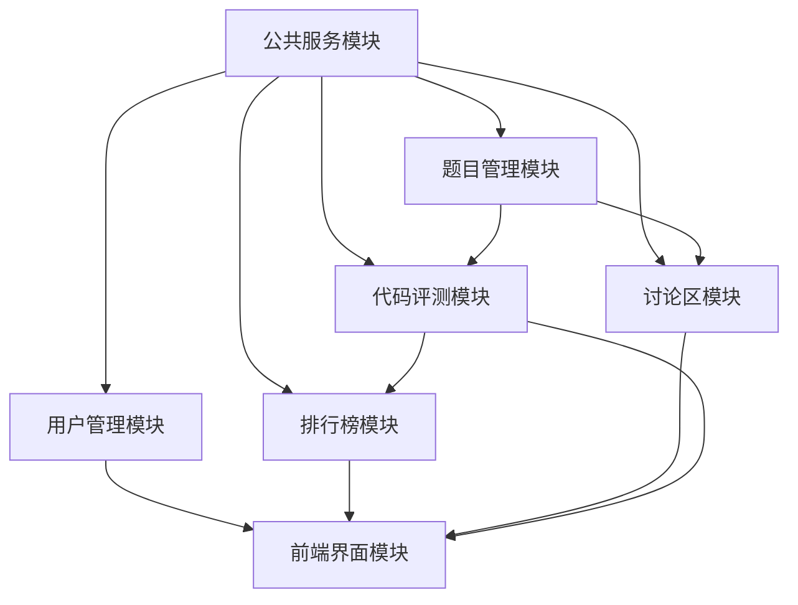
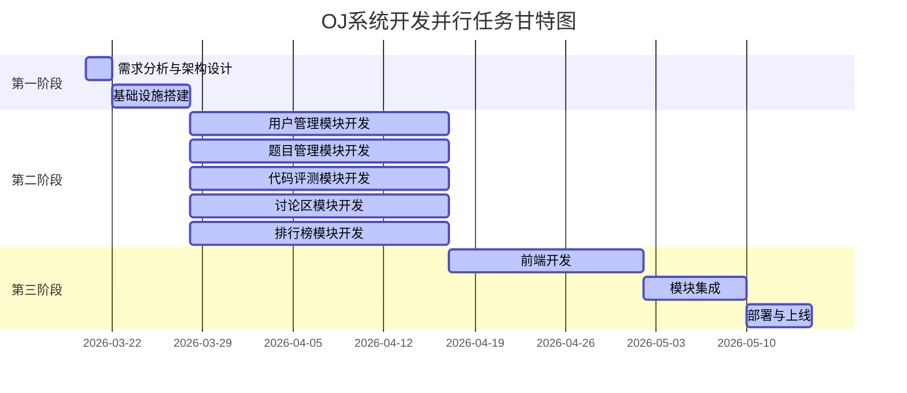

# 在线判题系统（OJ） - 任务并行性分析和流程规划

## 一、任务并行性分析

### 1. 模块依赖关系分析

| 模块 | 依赖模块 | 被依赖模块 | 依赖强度 |
|------|----------|------------|----------|
| 公共服务模块 | 无 | 用户管理、题目管理、代码评测、排行榜、讨论区 | 强依赖 |
| 用户管理模块 | 公共服务模块 | 所有需要用户认证的模块 | 强依赖 |
| 题目管理模块 | 公共服务模块 | 代码评测模块、讨论区模块 | 强依赖 |
| 代码评测模块 | 公共服务模块、题目管理模块 | 排行榜模块 | 强依赖 |
| 排行榜模块 | 公共服务模块、代码评测模块 | 无 | 弱依赖 |
| 讨论区模块 | 公共服务模块、题目管理模块 | 无 | 弱依赖 |
| 前端界面模块 | 无（通过API调用） | 无 | 无依赖 |

### 2. 可并行开发的任务组合

#### 第一阶段：基础设施搭建
- **公共服务模块**（成员4）：HTTP服务器框架、数据库连接池、日志系统、缓存管理
- **环境配置**（所有成员）：开发环境搭建、技术栈熟悉

#### 第二阶段：核心功能开发
- **用户管理模块**（成员3）与**题目管理模块**（成员2）：两个模块相对独立，可同时开发
- **代码评测模块**（成员1）：核心功能，可独立开发，但与题目管理模块有接口依赖
- **讨论区模块**（成员6）：相对独立，可与其他模块并行开发
- **排行榜模块**（成员5）：依赖代码评测模块的提交数据，但可先设计架构

#### 第三阶段：前端开发与集成
- **前端界面模块**（成员6/成员1/成员2）：可与后端模块并行开发，通过API文档进行对接
- **模块集成**（所有成员）：API接口对接、功能测试

### 3. 关键路径识别

1. **公共服务模块** → **用户管理模块** → **其他需要认证的模块**
2. **公共服务模块** → **题目管理模块** → **代码评测模块** → **排行榜模块**
3. **前端界面模块** → **与所有后端模块集成**

### 4. 模块依赖关系图

### 5. 并行开发图

### 6. 并行开发策略

- **资源分配**：确保核心模块（代码评测、题目管理）有足够的开发时间和资源
- **接口定义**：提前定义模块间的API接口，减少集成时的冲突
- **定期同步**：每日站会同步进度，及时解决依赖问题
- **模块化设计**：确保各模块高内聚、低耦合，便于并行开发

## 二、开发流程规划

### 1. 阶段划分

| 阶段 | 时间 | 主要任务 | 负责成员 | 交付物 |
|------|------|----------|----------|--------|
| 需求分析与架构设计 | 2天 | 1. 确定系统架构和技术方案 2. 制定API接口规范和数据模型 3. 明确模块职责和边界 | 所有成员 | 1. 架构设计文档 2. API接口规范 3. 数据模型设计 |
| 基础设施搭建 | 5-7天 | 1. 搭建HTTP服务器框架 2. 实现数据库连接池 3. 搭建日志系统 4. 配置Redis缓存 | 成员4 | 1. 公共服务模块基础代码 2. 开发环境配置文档 |
| 核心功能开发 | 18-22天 | 1. 用户管理模块：注册登录、权限控制 2. 题目管理模块：题目发布、分类搜索 3. 代码评测模块：编译运行、沙箱安全 4. 排行榜模块：排名计算、统计数据 5. 讨论区模块：讨论主题、评论回复 | 成员1-6 | 1. 各模块核心代码 2. 单元测试用例 |
| 前端开发 | 12-15天 | 1. 页面设计与实现 2. 代码编辑器集成 3. 数据可视化展示 4. 响应式布局优化 | 成员6、成员1、成员2 | 1. 前端页面代码 2. 前端与后端API对接 |
| 集成测试 | 6-8天 | 1. 模块间接口测试 2. 系统功能测试 3. 性能测试与优化 4. 安全性测试 | 所有成员 | 1. 测试报告 2. 性能优化报告 |
| 部署与上线 | 4-5天 | 1. 系统部署 2. 安全配置 3. 监控设置 4. 上线验证 | 所有成员 | 1. 部署文档 2. 上线验证报告 |

### 2. 里程碑设置

| 里程碑 | 时间点 | 达成条件 | 检查项 |
|--------|--------|----------|--------|
| 架构设计完成 | 2026-03-21结束 | 1. 架构设计文档完成 2. API接口规范确定 3. 数据模型设计完成 | 1. 架构评审通过 2. 所有成员理解架构设计 |
| 基础设施搭建完成 | 2026-03-27结束 | 1. HTTP服务器框架搭建完成 2. 数据库连接池实现 3. 日志系统搭建完成 | 1. 公共服务模块可正常运行 2. 其他模块可基于此开发 |
| 核心功能开发完成 | 2026-04-16结束 | 1. 所有后端模块核心功能实现 2. 单元测试通过 3. 模块间接口对接完成 | 1. 后端功能完整测试通过 2. API文档更新完成 |
| 前端开发完成 | 2026-04-30结束 | 1. 所有前端页面实现 2. 前端与后端API对接完成 3. 用户界面优化完成 | 1. 前端功能完整测试通过 2. 用户体验评估通过 |
| 系统集成完成 | 2026-05-08结束 | 1. 系统功能测试通过 2. 性能测试通过 3. 安全性测试通过 | 1. 集成测试报告通过 2. 问题修复完成 |
| 系统上线 | 2026-05-13结束 | 1. 系统部署完成 2. 监控设置完成 3. 上线验证通过 | 1. 部署文档完成 2. 系统正常运行 |